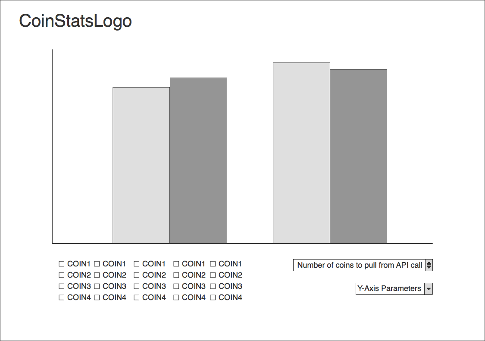

## CoinStats

### Background and Overview

CoinStats is a data visulization tool that allows a user to quickly scope out the current crypto currecy market climate.  The cryptocurrency market is a rapidly growing and thriving marketplace that requires persistant monitoring.

### Functionality & MVP

With CoinStats, users will be able to:

- [ ] Sort charts based on
* Price in their desired currency
* Market Volume
* % Change in value over a specified time period
- [ ] Determine how many coins will be displayed on the graph.
* Allow the user to compare specific coins against each other
- [ ] Pull current data from an external API
* CoinMarketCap API

### Wireframes

This app will consist of a single screen with a bar graph with each currency on the X-Axis and the desired stat to view on the Y-Axis.  Selectors in the form of dropdowns for the specific currency and

### Architecture and Technologies

This project will be implemented with the following technologies:

- Vanilla JavaScript for overall structure and data filtering,
- `JQuery` for managing fetching of market data from an external API.
- `ChartJS` for graph rendering.

### Implementation Timeline

**Over the weekend**:
- [x] Research and select an appropriate API for data.
*   Note: was going to use CoinBin but was unavailable at the time of research.  Determined that Coinmarketcap's api was a sutiable replacment.
- [x] Determine the appropriate Graphing library for displaying data
* Looked into both D3 and Chart.js, determined Chart to be the most sutiable library.

**Day 1**: Setup all necessary Node modules, including getting webpack up and running.  Create `webpack.config.js` as well as `package.json`.  Write a basic entry file and ensure that everything is running properly.

- [ ] Get `webpack` up and running.  Complete skeleton of index.html.
- [ ] Get a basic chart up and running with chartjs.

**Day 2**: Ensure that graphing is working without selectors, style the graphs and determine the final overall look of the project.

- [ ] Determine the best way to handle data, is it possible to have live updating data?
- [ ] Style the graphs and make everything reactive.

**Day 3**: Expand the capabilities of the graphs, implement user selection and filtering.

- [ ] Determine and implement the most optimal amount of data to show on screen.
- [ ] Implement user selection of data
* Change Number of coins to display on the graph
* Change data to be displayed on the Y axis (need to look into log graphing)

**Day 4**: Polish up UI and UX and finish README and clean up code.

- [ ] Ensure that all code is functioning and ready for production
- [ ] Ensure that code is behaving on an externally hosted env.

